# Organisational App Platform Plan

## Purpose

This plan repositions `AOC-App-Template-NextJS` from a simple application starter into an organisational upgrade path for user-created applications. The target user starts with a small local project, potentially only an `index.html`, and asks an agent to adopt this repository's standards. The template then tells the original project what it needs to become a governed, deployable, secure internal application.

The legacy `EvanExner/AOC-App-Template` model already has useful foundations: `app.yml` as the governance contract, agent-facing instructions, Bicep modules, GitHub Actions, central deployment identity, and documentation checks. The next version should keep that operating model while replacing the Rails and Azure PostgreSQL assumptions with Next.js, Azure Container Apps, Microsoft Entra enterprise applications, and Databricks Lakebase.

Assumption: "Azure App Containers" in the brief means Azure Container Apps.

## Source Material Considered

- Legacy repository: `EvanExner/AOC-App-Template`, including `app.yml`, `AGENTS.md`, `CLAUDE.md`, `INSTRUCTIONS.md`, `.github/workflows/*`, `infra/main.bicep`, and `docs/security.md`.
- Attached design document: `Self-Service Application Provisioning on Azure.docx`.
- Current product references:
  - [Azure Container Apps](https://learn.microsoft.com/en-us/azure/container-apps/)
  - [Container Apps managed identities](https://learn.microsoft.com/en-us/azure/container-apps/managed-identity)
  - [GitHub Actions OIDC to Azure](https://learn.microsoft.com/en-us/azure/developer/github/connect-from-azure-openid-connect)
  - [Microsoft Entra app registrations](https://learn.microsoft.com/en-us/entra/identity-platform/quickstart-register-app)
  - [Microsoft Entra app roles](https://learn.microsoft.com/en-us/entra/identity-platform/howto-add-app-roles-in-apps)
  - [Azure Databricks Lakebase Postgres](https://learn.microsoft.com/en-us/azure/databricks/oltp/)
  - [Lakebase authentication](https://docs.databricks.com/aws/en/oltp/projects/authentication)
  - [Lakebase Postgres roles](https://docs.databricks.com/aws/en/oltp/projects/postgres-roles)
  - [Azure Databricks OpenSharing / Delta Sharing](https://learn.microsoft.com/en-us/azure/databricks/delta-sharing/)
  - [Azure Monitor diagnostic settings](https://learn.microsoft.com/en-us/azure/azure-monitor/platform/diagnostic-settings)
  - [Azure Container Apps logging](https://learn.microsoft.com/en-us/azure/container-apps/logging)
  - [Microsoft Entra logs to Azure Monitor](https://learn.microsoft.com/en-us/entra/identity/monitoring-health/howto-integrate-activity-logs-with-azure-monitor-logs)
  - [Azure Databricks audit logs](https://learn.microsoft.com/en-us/azure/databricks/admin/account-settings/audit-logs)
  - [Microsoft Purview auditing](https://learn.microsoft.com/en-us/purview/audit-solutions-overview)
  - [Microsoft Purview Data Map](https://learn.microsoft.com/en-us/purview/data-map)

## Target Architecture

The platform should separate two concerns:

- **Application plane**: the user-owned Next.js code, API logic, migrations, docs, and tests.
- **Platform plane**: the organisation-owned provisioning workflows, Azure resources, Entra configuration, Lakebase database provisioning, shared policies, and governance checks.

Each adopted application should produce a predictable set of resources:

- One GitHub repository per application.
- One Azure resource group per application environment.
- One Azure Container App per app environment by default, running the Next.js web and API routes together.
- Optional split Container Apps only where a documented runtime, scaling, network, permission, or operational boundary requires it.
- One Microsoft Entra app registration and enterprise application.
- Standard Entra app roles and permission groups.
- Standard service accounts for deployment and runtime integration.
- One Databricks Lakebase database per app, with environment branches or databases as appropriate.
- Optional Lakebase synced tables or OpenSharing/Delta Sharing links to governed organisational datasets.
- Mandatory monitoring, tags, documentation, cost metadata, expiry/review dates, and runbooks.

```mermaid
flowchart LR
  User["User's original app<br/>index.html or local prototype"]
  Agent["Adoption agent<br/>reads this template"]
  Repo["App GitHub repo<br/>Next.js + app.yml + docs"]
  Workflows["GitHub Actions<br/>validate, provision, deploy"]
  Platform["Platform workflows<br/>owned by IT"]
  Azure["Azure resource group<br/>Container Apps + identity + monitoring"]
  Entra["Microsoft Entra<br/>app registration + enterprise app + groups"]
  Lakebase["Databricks Lakebase<br/>database + roles + OAuth DB tokens"]
  Data["Unity Catalog / shared data<br/>synced tables or OpenSharing"]

  User --> Agent
  Agent --> Repo
  Repo --> Workflows
  Workflows --> Platform
  Platform --> Azure
  Platform --> Entra
  Platform --> Lakebase
  Lakebase --> Data
  Azure --> Lakebase
  Entra --> Azure
```



## User Process

The user process should feel like guided self-service, not an approval queue.

1. **Adopt**: the user asks their coding agent to adopt this template. The agent reads `AGENTS.md`, `INSTRUCTIONS.md`, `app.yml`, and the adoption workflow.
2. **Assess**: the agent inspects the original app and writes a readiness report covering purpose, audience, data sensitivity, integrations, expected users, and operational intent.
3. **Classify**: the user and agent complete `app.yml`. The existing three axes should continue: scope, sensitivity, and timeline. Add fields for data sources, Entra roles, Lakebase mode, and required organisational datasets.
4. **Transform**: a simple `index.html` is wrapped into a Next.js app. Static pages become routes, shared assets move into `public/`, and any existing client-side API calls are converted into a typed middleware/API layer.
5. **Document**: missing docs are generated before deployment, including architecture, data model, security, runbook, support model, and user guide.
6. **Validate**: local and CI validators check metadata, documentation, tests, accessibility, security posture, infrastructure parameters, and classification rules.
7. **Provision dev**: GitHub Actions requests the platform workflow to create the dev environment.
8. **Deploy**: pushes to `dev` deploy to the `dev` environment; pushes to `main` deploy to `prod`.
9. **Promote**: movement to team, production, sensitive data, public ingress, or external users creates an oversight record and required evidence. The default stance is "approval by exception", matching the attached document.

## Governance Model

Governance should be evidence-driven. The platform should not ask every user to wait for human approval before learning whether an idea is useful. It should enforce hard boundaries automatically and surface exceptions clearly.

Keep the existing classification axes:

- `scope`: `personal`, `internal`, `external`
- `sensitivity`: `aoc-public`, `aoc-confidential`, `aoc-sensitive`
- `timeline`: `foundation`, `operational`, `mature`

Extend `app.yml` with:

- `runtime`: Next.js version, build command, health paths, and whether the app uses the default combined runtime or an approved split-runtime exception.
- `identity`: Entra app display name, required app roles, assignment groups.
- `database`: Lakebase project, branch strategy, database name, OAuth role names, migration command.
- `data_sources`: Unity Catalog tables, OpenSharing/Delta Sharing shares, permitted read/write mode.
- `operations`: owner, technical owner, support contact, service criticality, alert route.
- `deployment`: target Azure subscription, location, resource group name, GitHub environment, allowed branches.

Hard policy blocks should include:

- Personal apps cannot deploy to Azure.
- AOC-Sensitive data cannot be used in a foundation prototype.
- External access, public ingress, custom domains, Microsoft Graph permissions, and production require an oversight record.
- Unsupported Azure resources cannot be added by application repositories.
- Lakebase password roles should not be the default for runtime apps; OAuth database credentials with rotation should be the default.
- All database connections require SSL.
- Dedicated Lakebase projects require IT approval. The default model is a shared platform Lakebase project with one database per app environment, unless isolation requirements justify a dedicated project.
- Application permission groups must not be treated as Azure control-plane administrators. They can be assigned to Entra app roles, and may receive Azure Reader access where useful, but deployment and Azure administration remain platform-owned.

## Deployment Process

The deployment process should be split into provisioning and application deployment.

### Provisioning

Provisioning runs when `app.yml`, infrastructure parameters, Entra role definitions, or Lakebase settings change, or when manually triggered.

The workflow should:

1. Validate `app.yml` and classification rules.
2. Validate required documentation exists.
3. Run Next.js lint/typecheck/test checks where code exists.
4. Run Bicep build and what-if for Azure resources.
5. Dispatch the platform-owned provisioning workflow.
6. Create or update the Azure resource group and Container Apps resources.
7. Create or update the Entra app registration and enterprise application.
8. Create or update Entra app roles and assign standard groups.
9. Create or update Lakebase project/branch/database/roles.
10. Write deployment outputs back to GitHub environment variables or a generated provisioning record.

GitHub stores the required deployment secrets and variables. For Azure, prefer OIDC wherever possible so no Azure client secret is stored. For Databricks, store OAuth client secrets as GitHub secrets; non-secret identifiers such as host and client ID should become variables in the final platform model.

Recommended GitHub secrets and variables:

- Secrets: `DATABRICKS_OAUTH_SECRET_1`, `DATABRICKS_OAUTH_SECRET_2`
- Future platform-dispatch secret: `AOC_PLATFORM_DISPATCH_TOKEN`
- Variables: `AZURE_CLIENT_ID`, `AZURE_TENANT_ID`, `AZURE_SUBSCRIPTION_ID`, `AZURE_LOCATION`, `DATABRICKS_HOST`, `DATABRICKS_CLIENT_ID`, `LAKEBASE_ENDPOINT_PATH`, `LAKEBASE_PGHOST`, `LAKEBASE_PGPORT`, `PLATFORM_DISPATCH_REPO`, and allowed container registry.

### Application Deployment

Deployment runs on push to `dev` and `main`, and optionally through manual dispatch.

Branch mapping:

- `dev` deploys to the `dev` GitHub Environment and Azure app environment.
- `main` deploys to the `prod` GitHub Environment and Azure app environment.

The workflow should:

1. Install dependencies from a lockfile.
2. Run linting, typechecking, tests, and security/dependency scans.
3. Build an immutable image for the app. Build separate `web` and `api` images only where the app has an approved split-runtime design.
4. Push images to the approved Azure Container Registry using commit SHA tags or digests, never `latest`.
5. Update Container Apps revisions through the platform workflow.
6. Run health checks against the web and API endpoints.
7. Record deployment evidence in a generated release note or deployment record.

## Runtime Design

### Next.js

All adopted apps should become Next.js apps. For the first implementation, use a conservative structure:

```text
app/
  page.tsx
  api/
    health/route.ts
    ...
components/
lib/
  auth/
  lakebase/
  telemetry/
docs/
infra/
.github/workflows/
app.yml
AGENTS.md
CLAUDE.md
INSTRUCTIONS.md
```

A simple `index.html` project should map to:

- `app/page.tsx` for the initial page.
- `public/` for images, styles, and other static assets.
- `app/api/health/route.ts` for health checks.
- `docs/architecture.md` and `docs/user-guide.md` generated from the readiness report.

### Azure Container Apps

Default resources:

- `ca-{app}-{env}`: Next.js web front-end and API routes in one runtime.
- User-assigned managed identity for the runtime surface.
- Log Analytics diagnostics.
- Dapr disabled by default unless a real integration need exists.
- Scale-to-zero for foundation apps.
- Minimum one replica only for operational or mature apps where support expectations justify cost.

The web/API split remains a supported exception, not the default. Split into `ca-{app}-{env}-web` and `ca-{app}-{env}-api` only when the API needs different scale rules, network exposure, runtime permissions, operational ownership, or background processing characteristics.

## Entra Security Model

Every deployed app should have a Microsoft Entra app registration and corresponding enterprise application.

Default app roles:

- `App.Read`: can read app data and use standard app workflows.
- `App.Write`: can create or update app data.
- `App.Admin`: can administer app-level settings and access.

Service-to-service permissions should use explicitly named service principals and least-privilege database or API roles rather than being hidden inside human app permission groups.

Default app permission groups:

- `app-{app}-{env}-read`
- `app-{app}-{env}-write`
- `app-{app}-{env}-admin`

The app should authorise from Entra token claims, preferring app roles for application permissions. Groups can be assigned to app roles so application code sees stable `roles` values rather than tenant-specific group names.

The platform workflow should own app registration, redirect URIs, app roles, required assignment settings, and group assignment. Application code should not require users to manually create enterprise app objects.

These groups govern application access, not Azure control-plane administration. The same group names can be used as the single permission vocabulary across the application and Entra enterprise application assignment, but they should not automatically receive Azure Contributor, Owner, or User Access Administrator. Where visibility is helpful, app groups may receive Azure Reader on their application resource group.

## Lakebase Database Model

Lakebase should become the standard transactional database layer.

Recommended model:

- One shared platform Lakebase project by default.
- One database per app environment.
- Dedicated Lakebase projects require IT approval and should be reserved for mature, sensitive, high-isolation, or high-criticality applications.
- `production` branch protected for mature environments.
- `development` and `staging` branches for non-production work.
- One runtime OAuth Postgres role for the application service principal.
- Optional group OAuth roles for admin and read-only operational access.
- SQL grants generated from a least-privilege policy.

Lakebase database identifiers should use underscores rather than hyphens to avoid awkward quoted identifiers in PostgreSQL. The standard pattern is `db_app_<app>_<env>`, for example `db_app_trip_management_prod`.

Lakebase project naming should be platform-level rather than app-level when using the shared model. The platform deploys or references one shared project/server that contains the per-app-environment databases. Dedicated projects follow a separate approved naming standard.

Lakebase supports OAuth database credentials that expire after one hour. Runtime applications should implement token rotation and use the generated OAuth token as the database password over SSL. Long-lived Postgres passwords should be reserved for tools or exceptional compatibility needs, not the default runtime path.

The Lakebase runtime token flow is a priority proof of concept. The platform must prove how an Azure Container App mints or obtains short-lived Lakebase database credentials without embedding broad, long-lived Databricks credentials in application code. Until federation or a token broker is standardised, any Databricks client secret must be stored in GitHub environment secrets or runtime secret storage and treated as a transitional platform secret.

Provisioning responsibilities:

- Create Lakebase project/branch/database.
- Create OAuth Postgres roles for the Databricks service principal and approved groups.
- Grant schema/table privileges.
- Store connection metadata, not database passwords, in GitHub environment variables.
- Configure the app to mint short-lived database credentials at runtime.
- Run migrations through a controlled workflow identity.

## Audit And Observability

Audit must be layered. No single system should be treated as the complete record of truth.

Application audit events should be written to the app's Lakebase database as first-class business records. These events should capture who did what, to which business object, when, from which app role, and with what request correlation ID. This gives the application owner a durable audit trail close to the transactional data.

For redundancy, the application should also emit structured audit log events to stdout so Azure Container Apps can route them through Azure Monitor and Log Analytics. This protects the organisation if a foundation app is later deleted, its database is decommissioned, or a failed project needs post-mortem evidence. The Log Analytics copy should include the same correlation ID as the Lakebase audit row, but it should not include sensitive payloads or secrets.

The platform audit model should include:

- **Application audit**: durable app-level audit tables in Lakebase.
- **Runtime telemetry**: structured Container Apps logs, HTTP logs, health checks, and revision events in Log Analytics.
- **Azure control-plane audit**: Azure Activity Log and resource diagnostic settings routed to Log Analytics.
- **Identity audit**: Microsoft Entra sign-in and audit logs routed to Azure Monitor / Log Analytics where tenant policy permits.
- **Databricks audit**: Databricks audit logs and system tables for Lakebase, workspace, data-sharing, and permission events. Some Databricks events are not available through Azure diagnostic settings, so the platform should not assume Log Analytics contains the full Databricks audit picture.
- **Purview governance**: Microsoft Purview Data Map and Audit where available for data discovery, classification, access review support, and compliance investigation.

Required app audit event fields:

- `event_id`
- `occurred_at`
- `actor_user_id`
- `actor_display_name`
- `actor_roles`
- `action`
- `resource_type`
- `resource_id`
- `environment`
- `request_id`
- `source_ip_hash`
- `result`
- `metadata_json`

The agent instructions should require audit design whenever an app introduces authentication, data mutation, administrative functions, sensitive data, exports, or integration with shared Databricks data.

## Databricks Data Integration

Applications may need governed organisational data already stored in Databricks. Do not copy broad datasets into every app database by default.

Recommended patterns:

- Use Lakebase synced tables where low-latency app reads are required.
- Use Unity Catalog grants for Databricks-native access.
- Use OpenSharing / Delta Sharing for governed read-only sharing across workspaces, tenants, or clients.
- Declare every shared dataset in `app.yml` with purpose, owner, classification, refresh expectation, and read/write mode.
- Treat row-level or column-level restrictions as data-owner responsibilities, not application code conventions.
- Where app-originated transactional changes need analytics, use Lakebase Change Data Feed to publish changes into Delta tables.

## Agent Guidance Files

This repository should ship with agent-facing files that tell coding agents how to upgrade and govern a project.

### `AGENTS.md`

Entry point for all agents. It should:

- Direct agents to read `INSTRUCTIONS.md` and `app.yml` before changes.
- Explain the adoption flow from local project to organisational app.
- Require Australian English in user-facing text.
- Warn when a change escalates scope, sensitivity, timeline, public exposure, data integration, or production readiness.
- Require documentation updates when behaviour, data, permissions, infrastructure, or operations change.

### `CLAUDE.md`

Claude-specific bridge to the same rules. It should not introduce a separate policy model.

### `INSTRUCTIONS.md`

The canonical source of truth. It should include:

- Classification axes and examples.
- Entra role and group model.
- Lakebase database and token rotation requirements.
- Azure Container Apps deployment rules.
- Documentation requirements.
- CI checks required before deployment.
- Exact warning text agents must use when a request changes risk level.

### Project-to-Project Handoff

To let this repository "tell" the original project what it needs, the adoption process should generate:

- `AOC_READINESS_REPORT.md`: what was found in the original app.
- `AOC_ADOPTION_PLAN.md`: what must change to become deployable.
- `AOC_GAP_REGISTER.md`: missing docs, tests, owners, data classification, or infrastructure.
- A patch set or pull request converting the original project into the standard structure.

## Source Management

Required repository controls:

- Protected `main` branch.
- Required pull request for production-impacting changes.
- Required status checks: metadata validation, docs check, lint, typecheck, tests, security scan, dependency scan, Bicep validation, and Lakebase provisioning dry run where possible.
- GitHub environments: `dev`, `test`, `prod`.
- Production environment requires oversight evidence before deployment.
- CODEOWNERS for platform-owned files: `infra/`, `.github/workflows/`, `AGENTS.md`, `CLAUDE.md`, `INSTRUCTIONS.md`, and deployment scripts.

Recommended workflows:

- `adopt-project.yml`: validates imported project structure and generated readiness artefacts.
- `validate.yml`: app metadata, docs, lint, typecheck, tests.
- `bicep-validate.yml`: Bicep build and what-if.
- `provision.yml`: dispatches platform provisioning.
- `deploy.yml`: builds and deploys the app image on push to `main`.
- `lakebase-migrate.yml`: runs database migrations with the controlled workflow identity.
- `docs-check.yml`: fails when required docs are missing after relevant changes.
- `promote-environment.yml`: records oversight evidence for operational, mature, sensitive, external, or production moves.

## Documentation Requirements

The agent should create documentation where it does not exist. Minimum docs:

- `docs/architecture.md`: runtime, Azure resources, Entra model, Lakebase model, integrations.
- `docs/data-model.md`: tables, ownership, classification, migrations, retention.
- `docs/security.md`: authentication, authorisation, secrets, database token rotation, network exposure.
- `docs/audit.md`: business audit events, Lakebase audit schema, Log Analytics routing, retention, and query examples.
- `docs/runbook.md`: deploy, rollback, health checks, common failures, database migration process.
- `docs/support.md`: owner, support route, service level, escalation.
- `docs/user-guide.md`: user workflows in plain Australian English.
- `docs/provisioning-record.md`: generated outputs from the latest successful provisioning run.
- `docs/oversight.md`: evidence for risk changes and production readiness.

Docs should be generated early and kept current by CI. Missing documentation should block deployment once the app moves beyond a personal or foundation state.

## Plan Of Attack

### Phase 1: Define the contract

- Replace the legacy Rails-oriented `app.yml` schema with a Next.js, Entra, Lakebase, and Container Apps schema.
- Port and expand validators from Ruby or replace them with the selected project runtime.
- Define hard policy blocks and softer oversight warnings.
- Produce first versions of `AGENTS.md`, `CLAUDE.md`, and `INSTRUCTIONS.md`.

### Phase 2: Build the adoption workflow

- Create an adoption checklist for importing a local project.
- Define how `index.html` becomes `app/page.tsx`.
- Generate readiness, adoption, and gap reports.
- Add documentation generation prompts/templates.
- Add local validation commands.

### Phase 3: Build the Next.js runtime standard

- Add a minimal Next.js scaffold.
- Add health endpoints for web/API.
- Add an Entra authentication adapter.
- Add a Lakebase database client with OAuth token rotation.
- Add an app audit logger that writes to Lakebase and emits structured Log Analytics-safe audit events.
- Add telemetry hooks and structured logging.

### Phase 4: Build Azure infrastructure

- Create Bicep modules for resource group, Container Apps, managed identities, ACR pull, Log Analytics, Key Vault or Container App secrets, budgets, and tags.
- Keep the web/API boundary logical in the codebase while using a single Container App runtime by default.
- Enforce internal-only defaults, approved Australian regions, approved SKUs, and mandatory tags.

### Phase 5: Build Entra provisioning

- Automate app registration and enterprise application creation.
- Create app roles and assignment requirements.
- Create or bind standard Entra groups.
- Register redirect URIs and API audiences.
- Record generated IDs into GitHub environment variables or provisioning records.

### Phase 6: Build Lakebase provisioning

- Automate Lakebase shared project lookup, database, branch, compute endpoint, OAuth role, and grant creation.
- Add an IT-approved path for dedicated Lakebase project creation.
- Create migration workflow.
- Add runtime token rotation and SSL enforcement.
- Add optional synced-table/OpenSharing declarations.

### Phase 7: Build GitHub Actions

- Add validation, provisioning, deployment, migration, documentation, and promotion workflows.
- Trigger deployment from pushes to `dev` and `main`.
- Pin third-party actions.
- Store Azure and Databricks deployment secrets in GitHub environments, preferring Azure OIDC over long-lived Azure secrets.

### Phase 8: Prove with a sample app

- Start with a single `index.html`.
- Run the adoption workflow.
- Produce the Next.js app, docs, `app.yml`, infrastructure parameters, and workflows.
- Provision dev.
- Deploy to `dev` from the `dev` branch, then to `prod` from `main`.
- Verify Entra login, app roles, Lakebase connectivity, token rotation, app audit writes, Log Analytics audit redundancy, health checks, logs, and rollback.

## Open Decisions

The following decisions have been resolved from the initial planning pass:

- Use one Container App by default. Split web/API only by documented exception.
- Use app-specific Entra groups named `app-{app}-{env}-{read|write|admin}`.
- Use those groups for application/enterprise app permissions, but keep Azure administration platform-owned.
- Use Azure resource group names such as `rg-app-trip-management-prod`.
- Use service principal names such as `sp-app-trip-management-prod-dbreader`, while storing immutable client/object IDs for automation.
- Use Lakebase database identifiers such as `db_app_trip_management_prod`.
- Use a shared platform Lakebase project by default. Dedicated Lakebase projects require IT approval.
- Use Lakebase as the durable application audit store and Log Analytics as a redundant operational copy.
- Store workspace-specific Databricks values such as `DATABRICKS_HOST` in GitHub environments rather than hardcoding them into the template.
- Use `main` as the default branch and `prod` deployment branch.
- Use `dev` as the `dev` deployment branch.
- Use shared Lakebase project `projects/aoc-apps-prod` with UID `b27afc57-8f3f-400a-96bf-86e92e82938e`.
- Use one-year default retention for Lakebase app audit rows unless overridden.
- Use one-year minimum retention for Log Analytics audit redundancy.
- Use `AOCLogAnalytics` initially rather than creating a separate Log Analytics workspace.

Remaining open decisions before implementation:

- Prove the Container Apps to Lakebase OAuth token minting path.
- Confirm what constitutes "oversight evidence" for production, external access, sensitive data, Microsoft Graph permissions, and shared Databricks datasets.
- Prove the Container Apps managed environment provisioning model during Phase 0 using the per-app-environment Container App pattern.

## Requirements

Record non-secret answers here before Phase 0. Do not paste client secrets, tokens, connection strings or private keys into this file.

### Azure target

- Tenant ID: `8f38a566-2ac4-45fd-b5bd-f8097b849ee6`
- Subscription ID: `d68f6255-86d1-4bc9-829b-0a80d18bbb07`
- Preferred region: `australiaeast`
- Container Apps: no AOC platform Container Apps currently exist. Container App resources should be individual per app environment, for example `ca-<appname>-dev`.
- Container Apps managed environment model: per-app-environment naming, for example `cae-<appname>-dev`, to preserve clean isolation at the runtime environment boundary unless later cost or network constraints justify consolidation.
- Azure Container Registry: created `acraocappsprod` in `rg-aoc-app-platform`, region `australiaeast`, SKU `Basic`, login server `acraocappsprod.azurecr.io`, admin user disabled.
- Log Analytics: `AOCLogAnalytics` exists in resource group `loganalytics`, region `australiaeast`, with observed retention of 730 days. Use this initially unless IT wants cost, access or retention isolation through a separate workspace.

### Databricks/Lakebase

- `DATABRICKS_HOST`: confirmed as `https://adb-4032175059293983.3.azuredatabricks.net`
- Shared Lakebase project: `projects/aoc-apps-prod`
- Shared Lakebase project UID: `b27afc57-8f3f-400a-96bf-86e92e82938e`
- First proof of concept uses Databricks service principal auth: to be confirmed

### Entra

Platform identity is allowed to create:

- App registrations: yes
- Enterprise apps: yes
- App roles: yes
- Groups named `app-*`: yes
- Group assignments to enterprise apps: yes

Production RBAC mitigation:

- The current deployment service principal has `Contributor` on `rg-app-aoc-app-template-nextjs-dev`, plus the required platform ACR and Log Analytics roles.
- `rg-app-aoc-app-template-nextjs-prod` does not exist yet. Before the first `main` to `prod` deployment, create the prod app resource group and grant the deployment service principal `Contributor` on that resource group.
- Treat this as a production readiness gate: the prod deployment workflow must prove the role assignment exists before attempting Container Apps, identity, or monitoring changes in prod.

Proof cleanup is tracked in [decommission-register.md](decommission-register.md). Keep proof app resources, shared platform assets, Lakebase audit retention and Log Analytics evidence separated so cleanup does not remove reusable platform capability or required audit records.

### GitHub

- Target GitHub org: `AustralianOlympicCommittee`
- This repo will be the template repo: yes
- GitHub Environments: `dev` and `prod`
- Branch mapping: `dev` branch deploys to `dev`; `main` branch deploys to `prod`

### Audit defaults

- Log Analytics audit redundancy retention: 1 year minimum
- Lakebase app audit row retention: 1 year unless overridden
- Current `AOCLogAnalytics` retention is observed as 730 days, so it already exceeds the one-year minimum

### Network stance

- Phase 0 can start with public Lakebase connectivity over SSL and locked-down credentials: yes
- Private networking/VNet posture must be solved before proof of concept: no

### GitHub secrets and variables

Store these GitHub Environment secrets later:

- `DATABRICKS_OAUTH_SECRET_1`
- `DATABRICKS_OAUTH_SECRET_2`

Store this later only if the final platform-dispatch path is used:

- `AOC_PLATFORM_DISPATCH_TOKEN`

Store these GitHub Environment or organisation variables later:

- `DATABRICKS_HOST`
- `DATABRICKS_CLIENT_ID`
- `AZURE_CLIENT_ID`
- `AZURE_TENANT_ID`
- `AZURE_SUBSCRIPTION_ID`
- `AZURE_LOCATION`
- `LAKEBASE_SHARED_PROJECT_NAME`
- `LAKEBASE_ENDPOINT_PATH`
- `LAKEBASE_PGHOST`
- `LAKEBASE_PGPORT`
- `PLATFORM_DISPATCH_REPO`
- `CONTAINER_REGISTRY_LOGIN_SERVER`

`LAKEBASE_ENDPOINT_PATH` must be the Databricks endpoint resource path used for `generate-database-credential`, for example `projects/{project-id}/branches/{branch-id}/endpoints/{endpoint-id}`. The PostgreSQL URI from the Lakebase Connect dialog supplies `LAKEBASE_PGHOST`, but the workflow derives the runtime database and user from the app/environment and Databricks service-principal application ID.

Current Phase 0 repository secrets already created:

- `DATABRICKS_HOST`
- `DATABRICKS_CLIENT_ID`
- `DATABRICKS_OAUTH_SECRET_1`
- `DATABRICKS_OAUTH_SECRET_2`

Databricks connection logic should use a two-level fallback: try `DATABRICKS_OAUTH_SECRET_1` first, then retry once with `DATABRICKS_OAUTH_SECRET_2` for authentication-related token or connection failures. Both attempts must avoid logging secret values.
